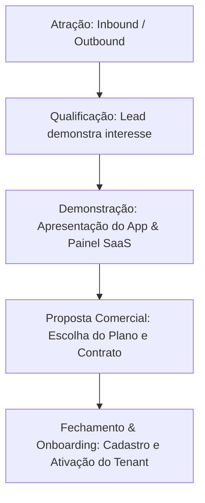
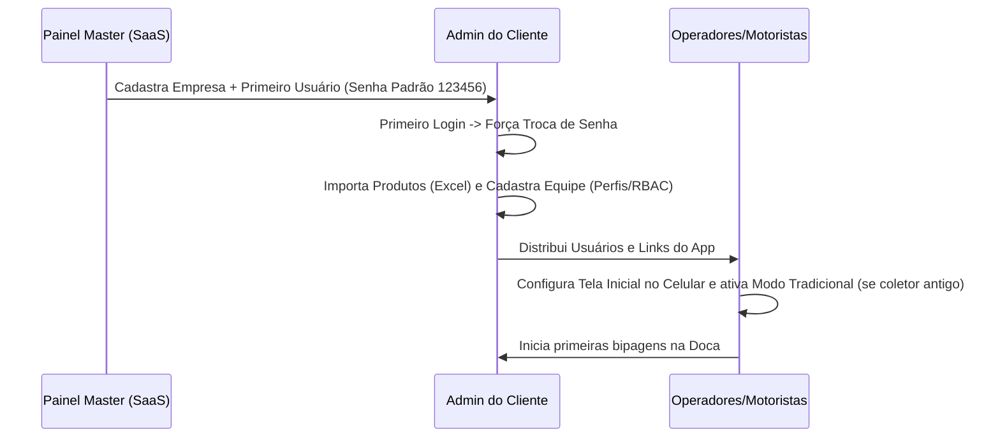

# 📈 Plano Comercial, de Vendas e Onboarding - Coletor IA

Este documento detalha a estratégia comercial, posicionamento de mercado, modelo de monetização, funil de aquisição de novos clientes e o roteiro de onboarding (ativação) para o **Coletor IA** (Estoque Fácil).

---

## 🎯 1. Perfil de Cliente Ideal (ICP - Ideal Customer Profile)

O sucesso de vendas do Coletor IA depende do foco nos segmentos corretos que mais sofrem com dores operacionais de logística. O ICP do sistema divide-se em três perfis:

### A. Centros de Distribuição e Operadores Logísticos de Médio Porte
*   **Dores Principais**: Erros frequentes na montagem de cargas (expedição de produtos ou quantidades erradas), perdas financeiras decorrentes de devoluções, falta de controle em tempo real da equipe de doca.
*   **Decisor**: Diretor de Operações, Gerente de Logística ou Dono da Empresa.

### B. Distribuidores Locais/Regionais (Alimentos, Bebidas, Autopeças, Cosméticos)
*   **Dores Principais**: Atraso na liberação de motoristas na expedição, motoristas entregando mercadorias trocadas no cliente final, perda de comprovantes físicos (canhotos de papel assinados).
*   **Decisor**: Gerente Geral ou Gerente de Frota.

### C. E-commerces com Operação de Estoque Própria
*   **Dores Principais**: Lentidão na separação (picking) e embalagem (packing), falta de acuracidade no estoque do sistema (divergências constantes de inventário físico).
*   **Decisor**: Diretor de E-commerce ou Gerente de Estoque.

---

## 💡 2. Proposta de Valor e Diferenciais Competitivos

Ao abordar potenciais clientes, a equipe de vendas deve focar nos seguintes diferenciais exclusivos:

1.  **Redução Imediata de Erros (Travas Duras)**: O conferente é fisicamente impedido pelo software de carregar produtos incorretos ou em quantidades superiores sem aprovação. Isso elimina custos de reentrega e devoluções.
2.  **Economia Massiva de Hardware (UI Windows 2000)**: A maioria dos WMS de mercado exige smartphones caros ou coletores de última geração. O Coletor IA roda de forma extremamente fluida em coletores antigos (Honeywell, Zebra) graças ao **Modo Tradicional**, que economiza até 90% de processamento e bateria.
3.  **Comprovante de Entrega Digital (POD) e Documentos Personalizados**: Assinatura na tela do smartphone, sem papelada, arquivado digitalmente. Geração de PDFs (Romaneios e Pedidos) totalmente customizados com a logomarca de cada cliente SaaS (White-labeling visual nativo).
4.  **Liberações Remotas em Tempo Real**: Gestores tomam decisões de liberação de divergências da sala de controle ou de casa, destravando a operação dos motoristas/conferentes instantaneamente.
5.  **Ajuste Inteligente de Estoque**: Ferramenta de inventário oficial que calcula divergências de sobras/faltas e atualiza a base do cliente com um único clique.
6.  **Gestão Completa de Equipamentos (Comodatos)**: Módulo integrado para controle rigoroso de patrimônios cedidos em comodato (freezers, expositores). Permite gerar e gerir ordens de serviço (Entrega, Recolha, Manutenção) conectadas diretamente ao banco de clientes.

---

## 💰 3. Modelo de Precificação (Pricing Tiers)

O modelo de negócios é baseado em **Assinatura SaaS Recorrente (Mensal/Anual)**, segmentada pelo número máximo de usuários ativos cadastrados (`max_users`).

| Plano | Limite de Usuários | Valor Mensal | Foco |
| :--- | :--- | :--- | :--- |
| **Plano Starter (Bronze)** | Até 5 usuários ativos | **R$ 290,00** | Pequenos armazéns ou e-commerces locais. |
| **Plano Growth (Prata)** | Até 15 usuários ativos | **R$ 590,00** | Distribuidores locais e CDs em expansão. |
| **Plano Enterprise (Ouro)** | Até 50 usuários ativos | **R$ 1.190,00** | Operações logísticas robustas e frotas de entrega. |
| **Plano Custom (Corporativo)** | Usuários ilimitados | **Sob Consulta** | Grandes corporações que necessitam de integrações API com ERPs legados (SAP, Protheus, Totvs). |

*   *Setup Fee (Opcional)*: Cobrança de uma taxa única de implantação/onboarding de R$ 500,00 a R$ 1.500,00 para planos Prata/Ouro (cobre o treinamento das equipes e a higienização/importação das planilhas de produtos).

---

## 📣 4. Funil de Vendas e Estratégia de Atração (Go-To-Market)

### Canais de Aquisição

#### 1. Outbound (Prospecção Ativa)
*   **Como**: Levantamento de leads qualificados no Google Maps (procurando "distribuidores", "transportadoras", "operadores logísticos" em regiões industriais) e LinkedIn.
*   **Abordagem**: Foco na dor financeira. *"Temos um sistema de bipagem que roda nos seus celulares/coletores atuais e que zera erros de carregamento. Podemos agendar uma demonstração de 10 minutos?"*

#### 2. Inbound Marketing & Conteúdo
*   **Como**: Tráfego pago no Google Ads focado em palavras-chave de intenção de compra:
    *   *“sistema de conferência de carga coletor de dados”*
    *   *“aplicativo para motorista assinar entrega”*
    *   *“wms multitenant barato”*
*   **Meta Ads**: Vídeos curtos gravados por operadores bipando caixas e o app bloqueando o carregamento errado, seguidos pelo gestor liberando pelo computador. O apelo visual do contraste entre o Modo Moderno e o Modo Retro atrai cliques de tomadores de decisão técnicos.

#### 3. Parcerias com Integradores e Consultores de ERP
*   **Como**: Oferecer comissionamento recorrente (Ex: 10% da mensalidade) para consultores de implantação de sistemas de gestão ERP. Muitos sistemas locais não possuem módulo WMS ou app de motorista, sendo o Coletor IA a extensão móvel perfeita.

---

## 🚀 5. Processo de Onboarding (Boas-Vindas e Ativação)

O onboarding estruturado garante que o cliente configure a operação rapidamente, reduzindo o *churn* (cancelamento) precoce.

### Roteiro Passo a Passo de Implantação

#### Passo 1: Criação da Conta no Painel Master
O time administrativo do SaaS acessa o painel `/saas` e realiza o cadastro da nova empresa:
1.  Insere a Razão Social, CNPJ e limite máximo de usuários (`max_users`).
2.  Define um **slug único** (Ex: `log-sul`). Este slug é de suma importância, pois servirá para o roteamento e isolamento de banco.
3.  Cadastra o primeiro usuário da empresa com a função `admin` e o nome fornecido pelo cliente. O sistema gera a credencial com a senha inicial padrão.

#### Passo 2: Primeiro Acesso e Segurança
1.  O cliente recebe o link de login e o usuário criado.
2.  Ao entrar, o sistema detecta que a credencial contém a senha inicial temporária e impede o acesso ao painel, redirecionando o navegador do usuário automaticamente para a tela de alteração de senha corporativa.
3.  O cliente insere uma nova senha segura. A senha é criptografada com SHA-256 no próprio navegador antes do envio ao Supabase.

#### Passo 3: Importação de Dados Cadastrais
No painel corporativo, o Admin do cliente executa:
1.  **Importação de Produtos**: Acessa `/produtos`, baixa o modelo de planilha e faz o upload da lista de SKU/códigos de barra do seu ERP contendo pesos e unidades de conversão (DUN14/caixa).
2.  **Cadastro da Equipe**: Acessa `/acesso`, cria os usuários e define os perfis (Conferente, Motorista, Gestor) e suas respectivas permissões de segurança.

#### Passo 4: Setup dos Dispositivos Móveis (Operadores e Motoristas)
1.  Os operadores acessam a URL do sistema em seus celulares/coletores de dados.
2.  **Dica Técnica**: Para melhor usabilidade, recomenda-se adicionar o atalho à tela inicial do celular como um PWA/Web-App.
3.  Caso estejam usando coletores de dados robustos baseados em processamento legado ou Android antigo, o operador acessa o menu de temas e ativa o **Modo Tradicional (Windows 2000)**.
4.  O sistema se adapta, removendo todo o processamento de GPU de transições visuais, permitindo a leitura contínua e instantânea de códigos de barra.

#### Passo 5: Rodada de Testes de Operação (Go-Live)
1.  O Gestor cria uma Rota de Entrega ou de Recebimento de testes.
2.  O operador realiza a simulação de bipagem na doca.
3.  O motorista simula a entrega na rua e colhe a assinatura digital na tela.
4.  O time de suporte SaaS acompanha as primeiras operações pelo dashboard via recurso de **Impersonation (Acesso Direto)**.
