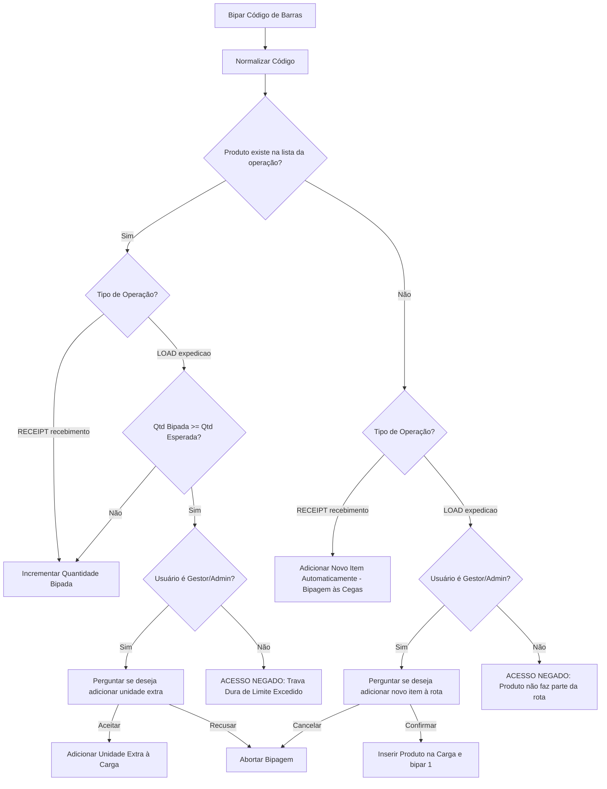

# 🛠️ SL Stock - Guia Técnico e Referência de Desenvolvimento

Este documento fornece um guia detalhado da arquitetura de código, fluxos de dados, estrutura de arquivos e integrações nativas do **SL Stock** (Estoque Fácil). Ele foi elaborado para auxiliar desenvolvedores e engenheiros a compreenderem o funcionamento interno da plataforma e como dar manutenção ou estendê-la.

---

## 📂 1. Estrutura Geral do Projeto

O projeto é estruturado como um Single Page Application (SPA) utilizando **React 19**, **TypeScript** e **Vite**, integrado ao **Supabase** no backend e empacotado para dispositivos móveis com o **Capacitor v8**.

Abaixo está o mapeamento detalhado dos diretórios principais e arquivos fundamentais:

```
coletor/
├── docs/                             # Documentações de planejamento comercial e sistema
├── public/                           # Ativos estáticos públicos (Favicon, Logos)
├── src/
│   ├── api/                          # Clientes de integração e chamadas do Supabase
│   │   ├── companies.ts              # Regras corporativas das empresas inquilinas
│   │   ├── deliveries.ts             # Entregas Last-Mile, POD e rotas de motoristas
│   │   ├── operations.ts             # Romaneios de expedição (LOAD) e recebimento (RECEIPT)
│   │   ├── products.ts               # Catálogo de mercadorias, alteração de saldos
│   │   ├── saas.ts                   # Painel administrativo Master (empresas, leads, recados)
│   │   └── users.ts                  # Gestão de operadores locais e permissões (RBAC)
│   ├── assets/                       # Arquivos e imagens consumidos pelo React
│   ├── components/                   # Componentes reutilizáveis
│   │   ├── layout/
│   │   │   └── AppLayout.tsx         # Estrutura de navegação (Shell) dinâmica do app
│   │   ├── ui/                       # Componentes de interface base (Shadcn modificados)
│   │   │   ├── badge.tsx, button.tsx, card.tsx, dialog.tsx, etc.
│   │   ├── BarcodeCameraScanner.tsx  # Scanner de câmera de alta velocidade (html5-qrcode)
│   │   └── ThemeProvider.tsx         # Engine controladora do tema Moderno vs. Windows Retro
│   ├── contexts/
│   │   └── AuthContext.tsx           # Contexto global de autenticação, impersonate e sessões
│   ├── data/                         # Conjuntos de dados estáticos para testes
│   ├── lib/
│   │   └── supabase.ts               # Inicialização da conexão cliente do Supabase
│   ├── pages/                        # Telas e fluxos da aplicação
│   │   ├── Approvals/                # Painel administrativo de liberações remotas de cargas
│   │   ├── ClientHistory/            # Relatório detalhado das entregas por cliente
│   │   ├── Counts/                   # Auditoria (Contagem Avulsa) e Inventários Oficiais
│   │   ├── Deliveries/               # Rota e paradas de entregas do motorista
│   │   ├── Master/                   # Dashboard administrativo global SaaS (Master admin)
│   │   ├── Receipts/                 # Fluxo de recebimento de fábrica (Inbound)
│   │   ├── AccessControl.tsx         # Configuração granular de permissões (RBAC)
│   │   ├── AllLoads.tsx              # Listagem e acompanhamento das cargas
│   │   ├── App.css                   # Customizações globais de transição e paletas HSL
│   │   ├── App.tsx                   # Roteador central do sistema (React Router DOM v7)
│   │   ├── ChangePassword.tsx        # Tela de alteração forçada da senha temporária
│   │   ├── Conference.tsx            # Motor de bipagem (Recebimento/Carga/Retorno)
│   │   ├── CreateLoad.tsx            # Editor e criador de romaneios/cargas
│   │   ├── Dashboard.tsx             # Gráficos, resumos operacionais e avisos
│   │   ├── index.css                 # Configuração do Tailwind CSS e tokens de design
│   │   ├── Landing.tsx               # Landing Page pública e captação de leads
│   │   ├── Login.tsx                 # Login do operador (autenticação segura local)
│   │   └── Products.tsx              # Cadastro e monitoramento do estoque mínimo
│   ├── types/
│   │   └── database.ts               # Tipagens TypeScript para os modelos do PostgreSQL
│   └── utils/
│       ├── crypto.ts                 # Criptografia SHA-256 no lado do cliente
│       └── pdf.ts                    # Geração vetorial do comprovante de entrega (POD) em PDF
├── supabase/
│   └── migrations/                   # Histórico de alterações e migrações do banco de dados
├── capacitor.config.ts               # Configuração do invólucro mobile nativo (Android/iOS)
├── package.json                      # Dependências de scripts e bibliotecas externas
├── vercel.json                       # Configuração de redirecionamento de rotas para deploy
└── vite.config.ts                    # Configuração de build e compilação do Vite
```

---

## 🔒 2. Fluxo de Autenticação e Segurança

### Criptografia de Senhas no Cliente (`src/utils/crypto.ts`)
Para proteger as credenciais sem sobrecarregar a infraestrutura e garantir conformidade com políticas rígidas de segurança:
1. Ao cadastrar um usuário ou alterar a senha, o texto puro da senha **nunca** trafega pela rede.
2. A senha é submetida a um algoritmo de hash SHA-256 utilizando a API nativa do navegador (`crypto.subtle`).
3. O hash resultante de 64 caracteres hexadecimais é transmitido e armazenado na coluna `password_hash` da tabela `users`.
4. As funções de comparação também geram o hash localmente e comparam diretamente no banco de dados.

### Fluxo de Primeiro Acesso (Troca Obrigatória)
1. Novos usuários são cadastrados com a senha padrão temporária `123456` (hash SHA-256 pré-calculado correspondente).
2. No [AuthContext.tsx](file:///c:/Users/lucas/OneDrive/Projeto%20IA/coletor/src/contexts/AuthContext.tsx), ao logar, o sistema detecta se a senha fornecida bate com o hash padrão.
3. Se positivo, a flag `reset_requested` ou a detecção do hash padrão força o redirecionamento imediato para a tela `/trocar-senha` através de rotas protegidas em `App.tsx`.
4. O usuário não consegue acessar nenhuma outra rota ou dashboard logado até definir uma senha diferente.

### Impersonate (Acesso Direto pelo SaaS Master)
1. Um usuário master (`is_super_admin: true`) pode gerenciar empresas no painel `/saas` ou `/master`.
2. Para auxiliar no suporte, ele pode clicar em "Acessar" ao lado de qualquer empresa inquilina.
3. A aplicação salva temporariamente no `localStorage` a credencial simulada do inquilino, mas mantém um token de retorno.
4. O `AuthContext` atualiza o estado para que o master veja a interface do cliente como se fosse o administrador dele (`company_id` do cliente é setado), permitindo auditoria em tempo real. Um banner superior permite ao Master "Sair da simulação" e voltar ao painel administrativo SaaS.

---

## ⚡ 3. Motor de Temas: Moderno vs. Windows Retro (`src/components/ThemeProvider.tsx`)

O motor de temas cruza estilos estéticos e otimizações de hardware vitais para coletores legados.

*   **Modo Moderno**: Injeta classes baseadas em Tailwind CSS v4, utilizando transparências com Glassmorphism, sombreados desfocados (box-shadows pesadas), gradientes lineares dinâmicos (`bg-gradient-to-br`), bordas bem arredondadas (`rounded-2xl`) e micro-animações animadas por CSS/Vite.
*   **Modo Tradicional (Retro Windows 2000)**: Injeta a classe `.win2000` no corpo do documento.
    *   Substitui todas as fontes por fontes retro pixeladas ou sem serifa (MS Sans Serif, Tahoma, Courier New).
    *   Define bordas quadradas de radius zero (`border-radius: 0`).
    *   Simula o Bevel 3D clásico (chanfrado com borda dupla: cinza claro e sombras cinza escuro/preto) nos botões e inputs.
    *   **Desliga** por CSS todas as transições (`transition: none !important`), animações (`animation: none !important`), sombras (`box-shadow: none !important`) e filtros de desfoque (`backdrop-filter: none !important`).
    *   **Resultado**: Elimina o lag de renderização na bipagem, economizando CPU do WebView e bateria do coletor de dados físico.

---

## 📦 4. Fluxo e Lógica da Tela de Conferência (`src/pages/Conference.tsx`)

A tela de conferência é a tela operacional mais complexa e gerencia os fluxos de **Recebimento (Inbound)**, **Expedição (Outbound)** e **Retorno de Estoque**.

### Bipagem de Código de Barras
1. O input principal de bipagem (`scanRef`) permanece em foco contínuo.
2. Ao ler um código (seja por leitor bluetooth emulado como teclado, leitor de hardware embutido ou câmera), o formulário é submetido.
3. O código passa por normalização (`normalizeCode`), removendo espaços e caracteres especiais e convertendo tudo para caixa alta para evitar problemas de formatação.
4. O sistema localiza o produto no catálogo geral do tenant e busca a correspondência na lista da operação (`operation_items`).

### Lógica de Travas e Regras de Negócio



### Devolução e Retorno de Estoque
1. Quando a rota de entrega (`LOAD`) é finalizada, se houveram sobras de mercadorias no caminhão, o operador pode acessar a aba de **Retorno**.
2. Ao bipar os itens de retorno, o sistema valida que o operador não pode retornar mais unidades do que as que foram conferidas na carga original.
3. Ao finalizar, o sistema incrementa o estoque físico mestre (`products.stock`) e grava um item especial com prefixo `🔄 Devolução: [Nome do Produto]` na tabela de movimentações para manter o histórico e a rastreabilidade contábil.

---

## 🚛 5. Comprovantes de Entrega em PDF (`src/utils/pdf.ts`)

A exportação de POD (Proof of Delivery) gera relatórios otimizados para arquivamento digital ou compartilhamento via WhatsApp e e-mail.

1. **Uso da Biblioteca `jsPDF`**: Desenha elementos vetoriais em coordenadas exatas do tamanho padrão A4.
2. **Cabeçalho Limpo**: Exibe o logotipo textual/estético da empresa emissora conectada e o CNPJ cadastrado à esquerda, com o número do pedido e título do documento destacados à direita.
3. **Controle de Quebra de Página Dinâmica**:
   * O utilitário monitora a coordenada vertical `y`.
   * Ao imprimir itens da entrega, se `y > 260`, o sistema automaticamente aciona `doc.addPage()`, reseta `y = 20`, redesenha a tabela de cabeçalho minimalista de itens e continua a renderização.
4. **Renderização de Assinatura Digital**:
   * O motorista colhe a assinatura do cliente na rua usando um painel Canvas HTML5 na tela do celular.
   * O canvas é convertido para Base64 PNG.
   * O PDF renderiza a imagem no quadro de finalização (`doc.addImage`) posicionando-a ao lado das caixas de texto com o Nome do Recebedor, Documento (RG/CPF) e Data/Hora da Assinatura.
5. **Diferenciação Web vs. Mobile (Capacitor)**:
   * **Navegador Desktop**: Dispara o download nativo do arquivo no navegador (`doc.save()`).
   * **Celular Nativo**: Converte o PDF para Base64, grava o arquivo no diretório de cache local do dispositivo utilizando o plugin `@capacitor/filesystem` e invoca a folha de compartilhamento nativa (`@capacitor/share`), permitindo enviar o comprovante em PDF diretamente para qualquer aplicativo instalado (ex: WhatsApp, Outlook, Gmail).

---

## 🗄️ 6. Banco de Dados, RLS e Migrações

O banco de dados é um banco relacional **PostgreSQL** hospedado no **Supabase**.

### Migrações Principais (`supabase/migrations/`)
*   `20260522_create_deliveries.sql`: Cria as tabelas do Last-Mile (`delivery_routes`, `delivery_clients`, `delivery_items`).
*   `20260522_fix_rls.sql`: Modifica as configurações de Row Level Security (RLS). Devido ao uso de uma chave de API comum em coletores que não utilizam o módulo padrão de autenticação do Supabase Auth (e sim um JWT de aplicação próprio baseado no par username/password_hash da tabela `users`), o RLS do Supabase é configurado para permitir transações na chave anônima, movendo o isolamento de segurança para as queries no frontend, que filtram de forma rígida pela coluna obrigatória `company_id`.
*   `20260523_add_approval_fields.sql`: Introduz campos de liberação remota de excedentes.
*   `20260524_make_username_unique.sql`: Cria uma restrição de unicidade para o login dos usuários.
*   `20260525_add_billing_fields.sql` & `20260525_add_checked_to_notes.sql`: Campos financeiros de mensalidade nas empresas e visualização de recados SaaS.
*   `20260528_add_physical_divergence.sql` & `20260528_create_operation_alerts.sql`: Estrutura os alertas automáticos que o dashboard exibe quando ocorrem cortes (divergências de carga na expedição).

---

## 📱 7. Empacotamento Mobile (Capacitor)

O Capacitor é utilizado para gerar builds nativos Android (`.apk` / `.aab`) e iOS.

### Configurações Importantes (`capacitor.config.ts`)
```typescript
import { CapacitorConfig } from '@capacitor/cli';

const config: CapacitorConfig = {
  appId: 'com.estoquefacil.coletoria',
  appName: 'Estoque Fácil',
  webDir: 'dist',
  server: {
    androidScheme: 'https'
  }
};

export default config;
```

### Permissões de Dispositivo (Hardware)
Para que o leitor de câmera funcione e o feedback tátil da vibração seja emitido:
*   **Android (`android/app/src/main/AndroidManifest.xml`)**:
    ```xml
    <uses-permission android:name="android.permission.CAMERA" />
    <uses-permission android:name="android.permission.VIBRATE" />
    ```
*   **iOS (`ios/App/App/Info.plist`)**:
    ```xml
    <key>NSCameraUsageDescription</key>
    <string>O Estoque Fácil necessita de acesso à câmera para realizar a leitura de códigos de barra dos produtos.</string>
    ```

---

## 🚀 8. Comandos de Inicialização e Manutenção

Para rodar e atualizar o projeto localmente ou em produção, execute os seguintes comandos no terminal:

### Instalação de Dependências
```powershell
npm install
```

### Rodar Servidor de Desenvolvimento Local
```powershell
npm run dev
```

### Compilar Build de Produção
Gera o bundle otimizado dentro da pasta `dist/`.
```powershell
npm run build
```

### Sincronizar Código com o Capacitor (Mobile)
Toda vez que fizer alterações no código React e quiser testar no emulador ou dispositivo físico:
```powershell
# 1. Compila o frontend React
npm run build

# 2. Copia os arquivos compilados e sincroniza plugins nativos no Android/iOS
npx cap sync
```

### Deploy no Vercel
O deploy é contínuo e integrado ao repositório GitHub. Qualquer commit aceito na branch `main` dispara o build automático do Vercel. 
As rotas virtuais são controladas por regras de reescrita em `vercel.json` para evitar erros `404` em atualizações de página diretas.
